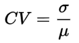

# Airport Traffic Control Assignment Report

The purpose of a task is to do something. The purpose of a thread is to execute a task. Tasks are ran in threads. One thread can only execute one task at any given time. Hence, the concurrency of a program is limited by the number of threads running concurrently to execute any number of given tasks.

An airport may have multiple runways and multiple aircrafts at any given time. The runways are fixed in place and are constantly accepting new tasks (aircrafts) given that the runway is available for use.

According to the problem statement, there are exactly 3 runways that allow aircrafts to land and depart. Therefore, no matter the number of aircrafts, only 3 aircrafts may actively do something at any given time.

Due to the reasons above, I have opted to create 3 runway threads. The aircrafts are represented as objects which wait in a BlockingQueue until it is given an opportunity to execute.

When a runway is free, it will take an aircraft from the queue to execute as a thread within the runway. The runway will pause and allow an aircraft to execute in its thread. Once the aircraft is finished executing, the aircraft terminates and the runway will resume, attempting to take another aircraft from the queue. This process repeats until no more aircrafts are left.

## Implementation

There are three java classes belonging to this program. The purpose and usage of each class is as follows:

### Aircraft

Aircraft is a runnable object. It has a status and an ID variable.

When instantiated, it accepts two parameters: an integer as its unique identifier and a Boolean to determine its status. If the Boolean value given is true, the aircraft&#39;s intention is to land. If the Boolean value is false, the aircraft&#39;s intention is to depart.

Once instantiated, it will announce that an aircraft with its ID has been created.

When ran, aircraft will announce which runway it has been assigned to. Then, it will announce its intention whether to land or depart. Depending on its intention, it will either sleep for 10 seconds to simulate the time taken to land, or sleep for 5 seconds if it is departing. Having done so, it will then announce that is has completed its intention.

### Runway

Runway is a runnable object. It has a usage counter, a BlockingQueue, an aircraft object, and a name.

When instantiated, it accepts two parameters: an integer as its unique identifier and a BlockingQueue to retrieve aircrafts from.

When ran, runway will rename its thread to reflect the runway&#39;s name. It will then start a continuous loop to constantly attempt to accept an aircraft from the BlockingQueue until the runway thread is terminated. After accepting an aircraft, it will increment its usage counter by 1. The aircraft will hijack the runway&#39;s thread to perform its tasks. Once the aircraft has completed its tasks, control is returned to the runway.

A printReport function exists to output the total times the runway was used by an aircraft.

### Airport

Airport is the main class of this program.

When executed, it will instantiate a random object to make certain decisions randomly. It will create a BlockngQueue to store aircrafts. The size of the BlockingQueue is arbitrarily set to a large number (1024 in this case) since this program is designed to be able to accommodate a large number of waiting aircrafts.

Next, it will create a fixed thread pool set to the limit of 3 threads. This is because there will be exactly 3 runways running concurrently at any given time. 3 runway objects are created and submitted to the thread pool to be executed.

Then, a for loop will create 10,000 aircrafts. One aircraft is created every 0 to 5 seconds. Once created, the aircraft is added to the BlockingQueue where it will wait to be assigned a runway. A random Boolean is passed to the aircraft constructor to determine if the aircraft is to land or depart.

Finally, once all generated aircrafts have been assigned a runway and the queue is emptied, the thread pool is shut down and the usage count of each runway is printed.

## Output

Each line will print the current time, followed by the aircraft identified by its ID, and the action done. An aircraft can have the following states/actions:

- Created
- Assigned to a specific runway
- Start to depart or land
- Complete departure or landing

The Runway will only create an output at the end of the program, printing the usage count of itself. Please refer to the next section &#39;Testing&#39;.

## Testing

10,000 aircrafts were created to test the fairness and robustness of this program.

If the program were to be 100% fair, each runway would have been used exactly 3333.33 times. In practice, it is almost impossible unless the program was specifically coded to ensure maximum fairness which would most certainly affect performance. To calculate the actual fairness, we will use Jain&#39;s fairness index. The equation is as follows:

To calculate the coefficient of variation:

Based on the results of the program:

Standard deviation, σ: 9.4633797110523

Mean, μ: 3333.3333333333

Coefficient of variation = 0.283901391%

Jain&#39;s fairness index = **93%**

Hence, this program can be considered as fair.

## Deadlock &amp; Starvation Prevention

Since there is no wait/notify system in this implementation, deadlock and starvation cannot occur in any scenario. The ArrayBlockingQueue queueing mechanism handles the producer (aircraft) and consumer (runway) with an internal built-in ReentrantLock which ensures that no race conditions will occur.

## Missing Pieces

An aircraft is hardcoded to take 5 seconds to take off, with no regard to other the status of other aircrafts and runways.

## Bugs

The fairness check will usually print before all aircrafts have landed/departed. This is because the fairness check executes the moment the queue is empty. An executed aircraft may sleep for 5 or 10 seconds to simulate the time taken to take off or land. However, the resulting output is still accurate and correct because all aircrafts have been successfully assigned a runway and incremented the usage counter.

## Conclusion

This implementation is extremely efficient and robust. It can handle a virtually unlimited amount of aircrafts. Each runway is fully utilized concurrently and never idle, all runways are used fairly and equally.
